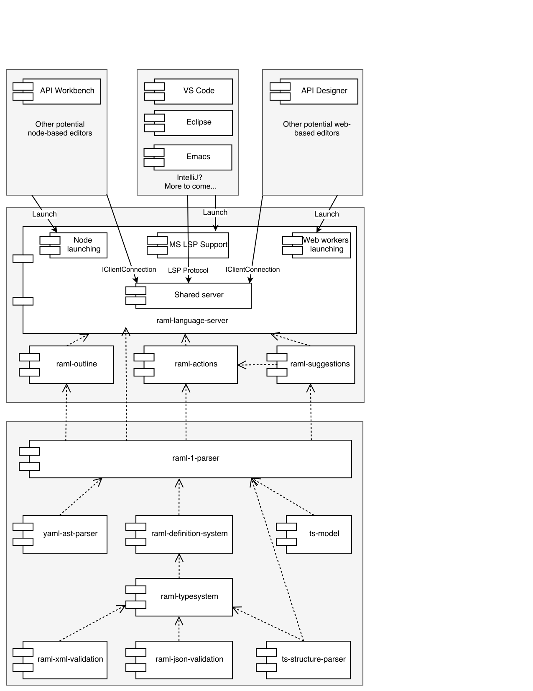

# RAML Language Server

A Language Server that exposes smart [RAML](http://raml.org/) language support for various IDEs
using the new [Language Server Protocol standard](https://github.com/Microsoft/language-server-protocol).


## Architecture

This project exposes not only the [RAML JS parser](https://github.com/raml-org/raml-js-parser-2) but also functionalities that are currently part of the [API Workbench](http://apiworkbench.com/) Atom package as a [Language Server](https://github.com/Microsoft/language-server-protocol).

RAML Server joins all the services and provides them as an interface with maximum simplicity. No RAML parser AST goes out from the LSP server. The LSP server has the full control of when and how RAML is parsed. The clients should not care about these details.

The supported clients are divided into 3 types, by the type of the way the client launches the server and the environment, the server is executed in. For each type of the launch/environment we add its own supporting code, which should only care about the details of launch/transport. No business logics of how to handle RAML is located in there.

**Node-based**

This type of launch expects the client and the server to be running in node.js. An example is the API Worbench.

**Web worker-based**

This type of launch expects the client to be running in the browser, and the server to be running in web worker. An example is the Monaco-based editor.

**MS LSP**

This type of launch expects the client to be running in the unknown environment, which supports MS LSP, and the server to be running in node.js. This allows to potentially support lots of current IDEs. An example is the VS Code plug-in. Note: each additional LSP client requires its own code, but that code is thin.



No client module directly depends on the service modules or parser modules. The only point of connection for the clients is the server itself.

Server module contains the following major parts:

* Server connection and server modules - this part is pure business logics, which either contains a direct implementation of RAML-related functionality, or a communicator to the related RAML service module.
* An implementation of three types of launching, for each type of the client this server supports. Clients should not implement their own code of launching external node processes etc, it should be ease to launch the server.
* An implementation of the protocol for the client to communicate to the server. Each protocol implementation contains two parts: client interface and a mechanism to transfer client interface calls/messages to the server and backwards. In case of MS LSP client interface is not needed, at least initially as we suppose that until we exceed current LSP support, clients already support protocol features that we support at the server part.

## Features and modules

Most of the features available in the [Language Server Protocol](https://github.com/Microsoft/language-server-protocol) and [VSCode Extensions](https://code.visualstudio.com/docs/extensions/overview) have already been developed and battle tested in the [API Workbench](http://apiworkbench.com/) Atom package.

We are currently working on extracting these features as stand-alone components that can be used to implement the LSP server.

There are a number of server modules, each providing a feature and, supposedly, binding on one or more of client connection methods.

The current list of modules, which is going to expand:
* Editor Manager - handles RAML documents, their contents, conversion of absolute positions to lines and columns etc.
* AST Manager - provides AST data to other modules, both on-demand and notification-based.
* Validation Manager - handles RAML validation reports.
* Structure Manager - handles RAML structure requests.
* Completion Manager - handles RAML suggestions.
* Details Manager - handles details of RAML element.
* Custom Actions manager - handles custom context-dependent actions.
* Fixed Actions Manager - central point to register fixed actions sub-modules.
    * Find References Action - provides the respective fixed action.
    * Open Declaration Action - provides the respective fixed action.
    * Mark Occurrences Action - provides the respective fixed action.
    * Rename Action - provides the respective fixed action.

Modules are located in `src/server/modules` folder and its subfolders.

## Code highlights

### Node-based client

An interface for this client is custom and simple. It contains a single method per major functionality feature.

In example, client can notify the server that a document was opened by calling a method:
```js
/**
 * Notifies the server that document is opened.
 * @param document
 */
documentOpened(document: IOpenedDocument);
```
Where `IOpenedDocument` has only two fields: document URI and document text.

And get notified about new validation reports from the server by adding a listener:

```js
/**
 * Adds a listener for validation report coming from the server.
 * @param listener
 */
onValidationReport(listener : (report:IValidationReport)=>void);
```

Or finding references by calling:

```js
/**
 * Requests server for the positions of the references of the element defined
 * at the given document position.
 * @param uri - document uri
 * @param position - position in the document
 */
findReferences(uri: string, position: number) : Promise<ILocation[]>
```

To get client connection, the index of the module provides `getNodeClientConnection` method. `stop` method shuts the server down.

It is possible that further along the road some data interfaces will change by receiving new fields, but the simplicity should be preserved.

Note the an emitter of an event can be both client and server. In example, client does not ask server for validation report, instead server notifies client that the new report is ready when the server has time to parse RAML and collection validation data. Server decides when and how to parse RAML and update IDE-related data, client can either subscribe to events, or ask for immediate/fast (but potentially outdated) results stored at the server.

Server implements node-based launching, a transport that transfers client/server calls via node messages and provides a single simple method, which launches the server and returns an instance of client connection.

In the current implementation prototype client interface is located in `src/client/client.ts` file `IClientConnection` interface, launching interface is located in `src/index.ts` `getNodeClientConnection()` method, launching implementation is located in `src/entryPoints/node` folder

### Web worker-based client

This type of client uses the same client interface as node-based client for unification.

Launching should handle web-worker related functionality and contain a simple method to launch the worker and return client connection. All transport should be handled by this type of launching and hidden from the client.

This is also the place where the “universal” server data like structure is converted to this particular client’s terms like outline if needed.

This client will be located in `src/entryPoints/web` when it is implemented.

### MS LSP client

This type of client has no client interface because this is something handled by the standard LSP clients, at least until we decide to extend what MS LSP currently provides.

Launching is represented by the proper LSP config, it is supposed that the client simply adds raml-language-client to dependencies list and refers it as a server module. For non-node clients it can be harder.

Communication is handled as server part by converting MS LSP server calls/data to/from server interface calls/data. This is also the place where the “universal” server data like structure is converted to this particular client’s terms like symbols if needed.

In the current implementation prototype launching implementation is located in `src/entryPoints/vscode` folder

### Server interface

Server interface is represented by the server connection and is something server business logics communicates to in order to provide its functionality to the clients. It resembles the client one for node-based clients:

Get knowing about document being opened:

```js
/**
 * Adds a listener to document open notification. Must notify listeners in order of registration.
 * @param listener
 */
onOpenDocument(listener: (document: IOpenedDocument)=>void);
```

Notifying the client about new validation report:

```js
/**
 * Reports latest validation results
 * @param report
 */
validated(report:IValidationReport) : void;
```

Finding the references by the client request and letting the client know the results:

```js
/**
 * Adds a listener to document find references request.  Must notify listeners in order of registration.
 * @param listener
 */
onFindReferences(listener: (uri: string, position: number) => ILocation[])
```

In the current implementation prototype server interface is located in `src/server/core/connections.ts` file `IServerConnection` interface, implementation is located in `src/server/core` folder.

### Document management

Editor Manager module provides following methods to let server know, which documents the client operates with:

```js
/**
 * Notifies the server that document is opened.
 * @param document
 */
documentOpened(document: IOpenedDocument);
```

```js
/**
 * Notified the server that document is closed.
 * @param uri
 */
documentClosed(uri: string);
```

```js
/**
 * Notifies the server that document is changed.
 * @param document
 */
documentChanged(document: IChangedDocument);
```

The client may also notify the server regarding cursor position by calling

```js
/**
 * Reports to the server the position (cursor) change on the client.
 * @param uri - document uri.
 * @param position - cursor position, starting from 0.
 */
positionChanged(uri: string, position: number): void;
```

Cursor position is being used to calculate context-dependent reports (actions, details, etc).

### Validation

Validation is being performed automatically by the server when the client reports content changes. It is not guaranteed that each change will cause re-validation, instead server for the pause in a chain of rapid changes before launching the validation.

As soon as the new validation report is available, it is being sent to the client, which may listen to the report by calling

```js
/**
 * Adds a listener for validation report coming from the server.
 * @param listener
 */
onValidationReport(listener: (report: IValidationReport) => void);
```

### Structure

RAML file structure can be obtained by calling

```js
/**
 * Requests server for the document structure.
 * @param uri
 */
getStructure(uri: string): Promise<{[categoryName: string]: StructureNodeJSON}>;
```

Instead of asking the server for the structure repeatedly, it is more efficient to subscribe to the structure reports that are calculated on real content changes and AST re-calculations:

```js
/**
 * Instead of calling getStructure to get immediate structure report for the document,
 * this method allows to listen to the new structure reports when those are available.
 * @param listener
 */
onStructureReport(listener: (report: IStructureReport) => void);
```

### Code completion

To get current suggestions the following should be called:

```js
/**
 * Requests server for the suggestions.
 * @param uri - document uri
 * @param position - offset in the document, starting from 0
 */
getSuggestions(uri: string, position: number): Promise<Suggestion[]>;
```

### Details

To request details directly, call:

```js
/**
 * Requests server for the document+position details.
 * @param uri
 */
getDetails(uri: string, position: number): Promise<DetailsItemJSON>;
```

Instead of asking the server for the details repeatedly, it is more efficient to subscribe to the details reports that are calculated on real content changes and AST re-calculations:


```js
/**
 * Report from the server that the new details are calculated
 * for particular document and position.
 * @param listener
 */
onDetailsReport(listener: (IDetailsReport) => void);
```

### Fixed Actions

To rename an element at position:

```js
/**
 * Requests server for rename of the element
 * at the given document position.
 * @param uri - document uri
 * @param position - position in the document
 */
rename(uri: string, position: number, newName: string): Promise<IChangedDocument[]>;
```

To find the location of the declaration of an element at position:

```js
/**
 * Requests server for the positions of the declaration of the element defined
 * at the given document position.
 * @param uri - document uri
 * @param position - position in the document
 */
openDeclaration(uri: string, position: number): Promise<ILocation[]>;
```

To find reference of an element at position:

```js
/**
 * Requests server for the positions of the references of the element defined
 * at the given document position.
 * @param uri - document uri
 * @param position - position in the document
 */
findReferences(uri: string, position: number): Promise<ILocation[]>;
```

To find occurrences of the element at position:

```js
/**
 * Requests server for the occurrences of the element defined
 * at the given document position.
 * @param uri - document uri
 * @param position - position in the document
 */
markOccurrences(uri: string, position: number): Promise<IRange[]>;
```

### Custom Actions

To calculate the list of the custom actions avilable in the current context, call:

```js
/**
 * Calculates the list of executable actions avilable in the current context.
 *
 * @param uri - document uri.
 * @param position - optional position in the document.
 * If not provided, the last reported by positionChanged method will be used.
 */
calculateEditorContextActions(uri: string,
                              position?: number): Promise<IExecutableAction[]>;
```

After user makes decision, whether/which action to execute, call `executeContextAction`, providing the action obtained on the call of `calculateEditorContextActions`:

```js
/**
 * Executes the specified action. If action has UI, causes a consequent
 * server->client UI message resulting in onDisplayActionUI listener call.
 * @param uri - document uri
 * @param action - action to execute.
 * @param position - optional position in the document.
 * If not provided, the last reported by positionChanged method will be used.
 */
executeContextAction(uri: string,
                     action: IExecutableAction, position?: number): Promise<IChangedDocument[]>;
```

If custom action has UI to display on the client side, in-between the `executeContextAction` promise resolving, server will come back to the client and ask to display the UI, so the client should subscribe to:

```js
/**
 * Adds a listener to display action UI.
 * @param listener - accepts UI display request, should result in a promise
 * returning final UI state to be transferred to the server.
 */
onDisplayActionUI(
    listener: (uiDisplayRequest: IUIDisplayRequest) => Promise<any>
);
```

### Providing client file system

For the server to know not only the content of RAML files, opened in the editors, but also other fragments and libraries, the client should be ready to answer to the following server's requests:

```js
/**
 * Listens to the server requests for FS path existence, answering whether
 * a particular path exists on FS.
 */
onExists(listener: (path: string) => Promise<boolean>): void;
```

```js
/**
 * Listens to the server requests for directory contents, answering with a list
 * of files in a directory.
 */
onReadDir(listener: (path: string) => Promise<string[]>): void;
```

```js
/**
 * Listens to the server requests for directory check, answering whether
 * a particular path is a directory.
 */
onIsDirectory(listener: (path: string) => Promise<boolean>): void;
```

```js
/**
 * Listens to the server requests for file contents, answering what contents file has.
 */
onContent(listener: (path: string) => Promise<string>): void;
```

## Contribution

If you are interested in contributing some code to this project, thanks! Please first [read and accept the Contributors Agreement](https://api-notebook.anypoint.mulesoft.com/notebooks#bc1cf75a0284268407e4).

To discuss this project, please use its [github issues](https://github.com/raml-org/raml-js-parser-2/issues) or the [RAML forum](http://forums.raml.org/).
